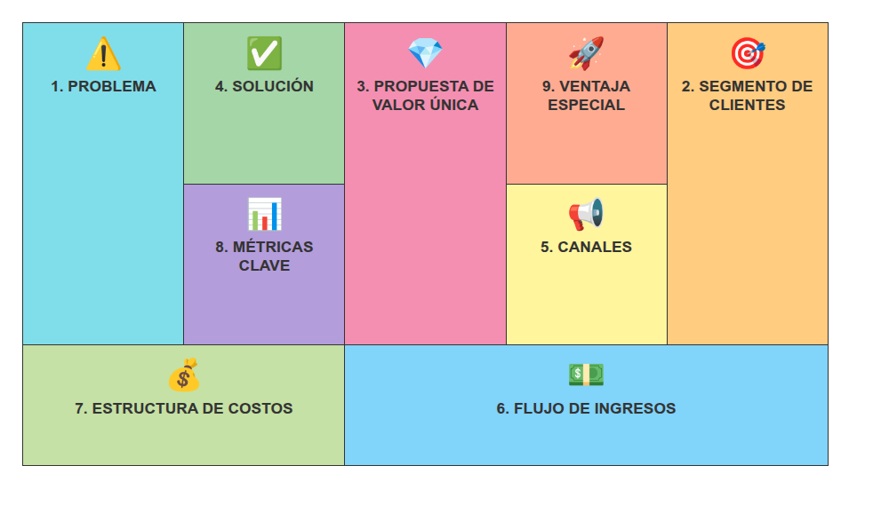
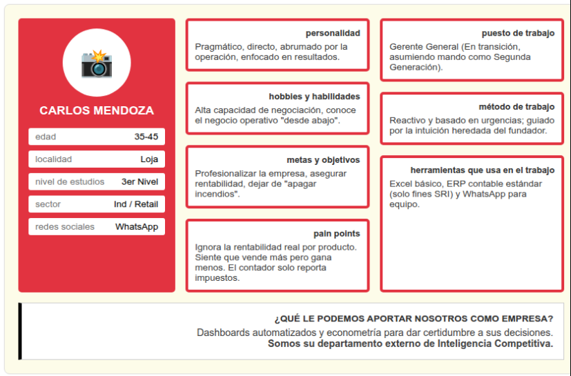
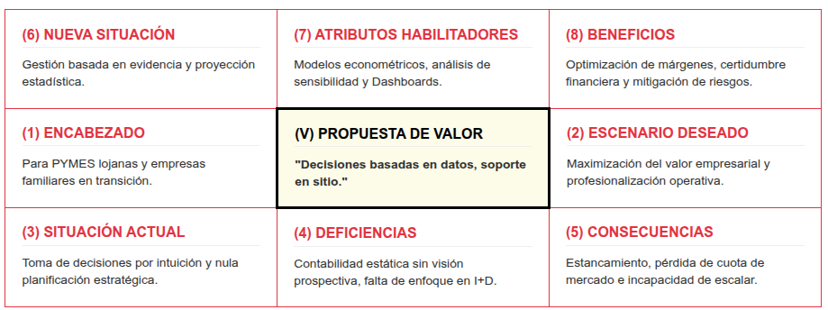

# Resumen

Este documento detalla la estructura operativa y estratégica de la Consultora Económica Loja (CEL). Nuestra misión es transformar datos en motores de crecimiento para el tejido empresarial del sur del país, cerrando la brecha entre la contabilidad tradicional y la inteligencia de negocios avanzada.

# Contexto del Mercado: PYMES en Loja

El ecosistema empresarial de Loja se caracteriza por un tejido denso de pequeñas y medianas empresas que actúan como el principal motor de empleo regional. Las PYMES industriales en Loja presentan un perfil de resiliencia crítica ante un entorno macroeconómico volátil; según @desarrollo2026, aproximadamente el 81% de estas unidades son empresas familiares con procesos de decisión centralizados y una fuerte herencia operativa. Al cierre de 2025 e inicios de 2026, el sector enfrenta una recuperación moderada tras la recesión de 2024, con proyecciones de crecimiento nacional situadas entre el 2% y 4% [@anefi2026].

En el contexto local, la Cámara de Comercio de Loja, bajo la presidencia de Fernando Flores (2026-2028), ha identificado que la competitividad se ve limitada por factores estructurales. La falta de articulación público-privada, sumada a los efectos de la inseguridad y la deficiente conectividad vial, incrementa los costos logísticos en un 15% por encima del promedio nacional [@cronica2026flores]. La Cámara de Industrias de Loja (CIL) reporta que, a pesar de estas barreras, las empresas locales en sectores como el agroindustrial y metalmecánico han mantenido su operatividad, aunque con cuellos de botella críticos en el acceso a financiamiento estructurado y digitalización avanzada [@cronica2026resiliencia; @lahora2024]. Actualmente, el 75% de las PYMES ecuatorianas carece de una estrategia de negocio explícita, delegando su supervivencia a la intuición operativa más que al análisis de datos prospectivos, lo que genera una vulnerabilidad sistémica ante la entrada de competidores nacionales con mayores capacidades de inteligencia de negocios [@guzman2025determinants; @lopez2024competitividad].

# El Lean Canvas Aplicado

El Lean Canvas [@maurya2010running] es una adaptación del Business Model Canvas [@osterwalder2010business] diseñada para startups y proyectos que operan en condiciones de alta incertidumbre. A diferencia del modelo original, este lienzo prioriza la validación del problema y las métricas clave antes de escalar la solución, permitiendo una iteración ágil basada en la respuesta del mercado [@maulida2022lean; @miro2026lean].

<style>
  .lean-canvas { 
    width: 100%; 
    table-layout: fixed; 
    border-collapse: separate; 
    border-spacing: 8px;
    text-align: center; 
    font-family: 'Inter', sans-serif; 
    margin-bottom: 2rem; 
    background: url('assets/economic_consultancy_loja_business_bg.png');
    background-size: cover;
    background-position: center;
    border-radius: 12px;
    padding: 10px;
    box-shadow: 0 10px 30px rgba(0,0,0,0.15);
  }
  .lean-canvas td { 
    border: none;
    padding: 20px 10px; 
    vertical-align: top; 
    cursor: pointer; 
    transition: all 0.3s cubic-bezier(0.4, 0, 0.2, 1); 
    border-radius: 8px;
    backdrop-filter: blur(2px);
  }
  .lean-canvas td:hover { 
    transform: translateY(-5px); 
    box-shadow: 0 8px 15px rgba(0,0,0,0.2);
    filter: brightness(1.1);
  }
  .lean-canvas a { 
    text-decoration: none; 
    color: white; 
    display: block; 
    height: 100%; 
    width: 100%; 
    font-weight: 700; 
    font-size: 0.9em; 
    text-shadow: 0 1px 3px rgba(0,0,0,0.3);
    text-transform: uppercase;
    letter-spacing: 0.5px;
  }
  .lc-prob { background-color: rgba(0, 43, 91, 0.9); } /* Azul Navy */
  .lc-sol { background-color: rgba(242, 123, 53, 0.9); } /* Naranja */
  .lc-met { background-color: rgba(57, 62, 70, 0.85); } /* Gris */
  .lc-uvp { background-color: rgba(37, 109, 133, 0.9); } /* Teal */
  .lc-ven { background-color: rgba(214, 90, 49, 0.9); } /* Terracota */
  .lc-can { background-color: rgba(242, 123, 53, 0.8); } /* Naranja suave */
  .lc-seg { background-color: rgba(0, 43, 91, 0.85); } /* Azul suave */
  .lc-cos { background-color: rgba(57, 62, 70, 0.9); } /* Gris oscuro */
  .lc-ing { background-color: rgba(37, 109, 133, 0.95); } /* Teal fuerte */
  .lc-icon { 
    font-size: 1.8em; 
    display: block; 
    margin-bottom: 12px; 
    filter: drop-shadow(0 2px 4px rgba(0,0,0,0.2));
  }
  .justified { 
    text-align: justify !important; 
    text-justify: inter-word;
  }
  p { 
    text-align: justify; 
  }
</style>

::: {.content-visible when-format="html"}
<table class="lean-canvas">
  <tr style="height: 150px;">
    <td rowspan="2" class="lc-prob"><a href="#b1"><span class="lc-icon">🛡️</span>1. PROBLEMA</a></td>
    <td class="lc-sol"><a href="#b4"><span class="lc-icon">💡</span>4. SOLUCIÓN</a></td>
    <td rowspan="2" class="lc-uvp"><a href="#b3"><span class="lc-icon">💎</span>3. PROPUESTA DE VALOR</a></td>
    <td class="lc-ven"><a href="#b9"><span class="lc-icon">🚀</span>9. VENTAJA ESPECIAL</a></td>
    <td rowspan="2" class="lc-seg"><a href="#b2"><span class="lc-icon">🎯</span>2. SEGMENTO</a></td>
  </tr>
  <tr style="height: 150px;">
    <td class="lc-met"><a href="#b8"><span class="lc-icon">📈</span>8. MÉTRICAS CLAVE</a></td>
    <td class="lc-can"><a href="#b5"><span class="lc-icon">📣</span>5. CANALES</a></td>
  </tr>
  <tr style="height: 100px;">
    <td colspan="2" class="lc-cos"><a href="#b7"><span class="lc-icon">💰</span>7. ESTRUCTURA DE COSTOS</a></td>
    <td colspan="3" class="lc-ing"><a href="#b6"><span class="lc-icon">💵</span>6. FLUJO DE INGRESOS</a></td>
  </tr>
</table>
:::

::: {.content-visible when-format="pdf"}

{width=100%}

:::

## Bloque 1 — Problema {#b1}

::: {.justified}
El núcleo de los desafíos enfrentados por las PYMES lojanas reside en la ausencia de una planificación estratégica robusta, donde la mayoría de los gerentes operan basándose en la intuición en lugar de análisis competitivos reales [@desarrollo2026]. Esta carencia se extiende a la gestión del capital humano, con un 82% de empresas reportando un desarrollo insuficiente de habilidades y una falta de incentivos ligados a la productividad. Como consecuencia, existe una baja orientación al mercado que impide responder con agilidad a la competencia, resultando en una pérdida progresiva de cuota de mercado frente a firmas nacionales.
:::

## Bloque 2 — Segmentos de Clientes {#b2}

::: {.justified}
### Perfil de Cliente Ideal
Nuestra estrategia se enfoca en tres nichos críticos del mercado lojano. Primero, las Agroindustrias de Procesamiento de café, lácteos o balanceados que, con plantillas de 10 a 20 empleados, buscan activamente certificar su calidad para la exportación. Segundo, el Retail y Comercio en Transición, compuesto por negocios familiares tradicionales que requieren optimizar sus inventarios y precios para competir con cadenas nacionales. Finalmente, las Empresas de Servicios en el Parque Industrial, específicamente en logística y metalmecánica, que demandan modelos de riesgo sofisticados para acceder a mayores líneas de crédito.

### Early Adopters (Nuestros primeros 5 clientes)
Los adoptantes tempranos de nuestros servicios se dividen en dos perfiles prioritarios. Por un lado, las empresas denominadas "Post-Crédito", que tras acceder a financiamiento institucional (CFN o Banco de Loja) enfrentan la presión inmediata de optimizar su flujo para garantizar el crecimiento [@cnc2025]. Por otro lado, la Segunda Generación Familiar, compuesta por sucesores que buscan profesionalizar el legado mediante la implementación de herramientas tecnológicas y metodologías de inteligencia competitiva.
:::

### Matriz de Buyer Persona: "Carlos, Segunda Generación"

Aplicando la metodología estructurada, mapeamos a nuestro prospecto principal. A continuación, el perfil detallado:

::: {.content-visible when-format="html"}
```{=html}
<div class="buyer-persona-container" style="background-color: #FDFCE9; padding: 20px; font-family: sans-serif; border: 1px solid #ddd; border-radius: 8px; margin-bottom: 2em;">
  <div style="display: flex; gap: 15px; flex-wrap: wrap;">
    <!-- Columna Izquierda: Perfil -->
    <div style="background-color: #E23340; width: calc(25% - 15px); min-width: 200px; border-radius: 5px; padding: 15px; display: flex; flex-direction: column; align-items: center; flex-grow: 1;">
      <div style="background-color: white; border-radius: 50%; width: 100px; height: 100px; display: flex; align-items: center; justify-content: center; font-size: 40px; margin-bottom: 10px;">
        📸
      </div>
      <h3 style="color: white; text-transform: uppercase; margin: 0 0 15px 0; text-align: center; font-size: 1.1em;">Carlos Mendoza</h3>
      <div style="width: 100%; background-color: white; margin-bottom: 8px; padding: 5px 10px; border-radius: 3px; font-size: 0.85em; text-align: right; box-sizing: border-box;">
        <span style="float: left; color: #777;">edad</span> 35-45
      </div>
      <div style="width: 100%; background-color: white; margin-bottom: 8px; padding: 5px 10px; border-radius: 3px; font-size: 0.85em; text-align: right; box-sizing: border-box;">
        <span style="float: left; color: #777;">localidad</span> Loja
      </div>
      <div style="width: 100%; background-color: white; margin-bottom: 8px; padding: 5px 10px; border-radius: 3px; font-size: 0.85em; text-align: right; box-sizing: border-box;">
        <span style="float: left; color: #777;">nivel de estudios</span> 3er Nivel
      </div>
      <div style="width: 100%; background-color: white; margin-bottom: 8px; padding: 5px 10px; border-radius: 3px; font-size: 0.85em; text-align: right; box-sizing: border-box;">
        <span style="float: left; color: #777;">sector</span> Ind / Retail
      </div>
      <div style="width: 100%; background-color: white; margin-bottom: 8px; padding: 5px 10px; border-radius: 3px; font-size: 0.85em; text-align: right; box-sizing: border-box;">
        <span style="float: left; color: #777;">redes sociales</span> WhatsApp
      </div>
    </div>

    <!-- Columna Central -->
    <div style="display: flex; flex-direction: column; width: calc(37.5% - 15px); min-width: 250px; gap: 15px; flex-grow: 1;">
      <div style="border: 4px solid #E23340; background-color: white; border-radius: 5px; padding: 10px; flex: 1;">
        <div style="text-align: right; font-weight: bold; font-size: 0.8em; color: #333; margin-bottom: 5px;">personalidad</div>
        <div style="font-size: 0.85em; color: #444;">Pragmático, directo, abrumado por la operación, enfocado en resultados.</div>
      </div>
      <div style="border: 4px solid #E23340; background-color: white; border-radius: 5px; padding: 10px; flex: 1;">
        <div style="text-align: right; font-weight: bold; font-size: 0.8em; color: #333; margin-bottom: 5px;">hobbies y habilidades</div>
        <div style="font-size: 0.85em; color: #444;">Alta capacidad de negociación, conoce el negocio operativo "desde abajo".</div>
      </div>
      <div style="border: 4px solid #E23340; background-color: white; border-radius: 5px; padding: 10px; flex: 1;">
        <div style="text-align: right; font-weight: bold; font-size: 0.8em; color: #333; margin-bottom: 5px;">metas y objetivos</div>
        <div style="font-size: 0.85em; color: #444;">Profesionalizar la empresa, asegurar rentabilidad, dejar de "apagar incendios".</div>
      </div>
      <div style="border: 4px solid #E23340; background-color: white; border-radius: 5px; padding: 10px; flex: 1;">
        <div style="text-align: right; font-weight: bold; font-size: 0.8em; color: #333; margin-bottom: 5px;">pain points</div>
        <div style="font-size: 0.85em; color: #444;">Ignora la rentabilidad real por producto. Siente que vende más pero gana menos. El contador solo reporta impuestos.</div>
      </div>
    </div>

    <!-- Columna Derecha -->
    <div style="display: flex; flex-direction: column; width: calc(37.5% - 15px); min-width: 250px; gap: 15px; flex-grow: 1;">
      <div style="border: 4px solid #E23340; background-color: white; border-radius: 5px; padding: 10px; flex: 1;">
        <div style="text-align: right; font-weight: bold; font-size: 0.8em; color: #333; margin-bottom: 5px;">puesto de trabajo</div>
        <div style="font-size: 0.85em; color: #444;">Gerente General (En transición, asumiendo mando como Segunda Generación).</div>
      </div>
      <div style="border: 4px solid #E23340; background-color: white; border-radius: 5px; padding: 10px; flex: 1;">
        <div style="text-align: right; font-weight: bold; font-size: 0.8em; color: #333; margin-bottom: 5px;">método de trabajo</div>
        <div style="font-size: 0.85em; color: #444;">Reactivo y basado en urgencias; guiado por la intuición heredada del fundador.</div>
      </div>
      <div style="border: 4px solid #E23340; background-color: white; border-radius: 5px; padding: 10px; flex: 2;">
        <div style="text-align: right; font-weight: bold; font-size: 0.8em; color: #333; margin-bottom: 5px;">herramientas que usa en el trabajo</div>
        <div style="font-size: 0.85em; color: #444;">Excel básico, ERP contable estándar (solo fines SRI) y WhatsApp para equipo.</div>
      </div>
    </div>
  </div>

  <!-- Sección Inferior -->
  <div style="margin-top: 15px; border-left: 5px solid black; border-top: 1px solid #ccc; border-right: 1px solid #ccc; border-bottom: 1px solid #ccc; padding: 15px; background-color: white;">
    <div style="font-size: 0.85em; font-weight: bold; color: #333; text-align: right; margin-bottom: 5px; text-transform: uppercase;">¿qué le podemos aportar nosotros como empresa?</div>
    <div style="font-size: 0.9em; color: #444; text-align: right;">Dashboards automatizados y econometría para dar certidumbre a sus decisiones.<br><strong>Somos su departamento externo de Inteligencia Competitiva.</strong></div>
  </div>
</div>
```
:::

::: {.content-visible when-format="pdf"}

{width=100%}

:::

## Bloque 3 — Propuesta de Valor Única {#b3}

### Matriz de Estado de Valor

A continuación, la deconstrucción de nuestra UVP aplicando la metodología de la *Matriz de Estado de Valor*:

::: {.content-visible when-format="html"}
| | | |
|:---|:---|:---|
| **(6) NUEVA SITUACIÓN**<br>Gestión basada en evidencia y proyección estadística. | **(7) ATRIBUTOS HABILITADORES**<br>Modelos econométricos, análisis de sensibilidad y Dashboards. | **(8) BENEFICIOS**<br>Optimización de márgenes, certidumbre financiera y mitigación de riesgos. |
| **(1) ENCABEZADO**<br>Para PYMES lojanas y empresas familiares en transición. | **(V) PROPUESTA DE VALOR**<br>"Decisiones basadas en datos, soporte en sitio." | **(2) ESCENARIO DESEADO**<br>Maximización del valor empresarial y profesionalización operativa. |
| **(3) SITUACIÓN ACTUAL**<br>Toma de decisiones por intuición y nula planificación estratégica. | **(4) DEFICIENCIAS**<br>Contabilidad estática sin visión prospectiva, falta de enfoque en I+D. | **(5) CONSECUENCIAS**<br>Estancamiento, pérdida de cuota de mercado e incapacidad de escalar. |

: Matriz de Estado de Valor UVP {#tbl-value-matrix}
:::

::: {.content-visible when-format="pdf"}

{width=100%}

:::

::: {.justified}
### Diferenciación Técnica

CEL se distingue por integrar una visión prospectiva que supera el registro histórico contable; mientras un contador tradicional analiza el pasado, nosotros proyectamos escenarios futuros mediante modelos econométricos y simulaciones de Monte Carlo. Esta capacidad técnica permite una optimización de márgenes precisa, identificando fugas de eficiencia en la cadena de valor y capturando márgenes mediante precios dinámicos. Finalmente, nuestra metodología garantiza una mitigación de riesgos basada en análisis de sensibilidad, reduciendo significativamente la incertidumbre inherente a los procesos de inversión e innovación empresarial.

### Valor Estratégico para la PYME Lojana
El valor estratégico que CEL aporta a la PYME lojana se fundamenta en democratizar el acceso a la inteligencia competitiva de bajo costo, aplicando metodologías de consultoría de élite adaptadas a la realidad presupuestaria local. Logramos una reducción de asimetrías crítica al transformar datos "muertos" en tableros de control dinámicos que permiten decisiones en tiempo real, actuando efectivamente como un departamento externo de I+D que identifica oportunidades de mercado basadas en tendencias sectoriales frecuentemente ignoradas.

### Ventaja Local y Confianza
Nuestra ventaja competitiva reside en la cercanía y el respaldo técnico. Ofrecemos un soporte en sitio que permite visitas técnicas recurrentes sin los elevados costos logísticos de firmas nacionales, garantizando un acompañamiento real en la implementación de estrategias. Este servicio se apoya en un profundo entendimiento del ecosistema del sur, conociendo las particularidades de los gremios locales y los ciclos industriales regionales [@lopez2024competitividad], todo bajo un respaldo académico-técnico que asegura el uso de metodologías validadas y bases de datos especializadas.
:::

### Paisaje Competitivo en Loja

Para validar nuestra posición, hemos mapeado los actores actuales y sus limitaciones frente a las necesidades PYME:

| **Actor** | **Especialidad** | **Debilidad Explotable** |
|:---|:---|:---|
| AGEMIC | Fiscalización y obra civil. | No cubre estrategia ni finanzas. |
| MB Consultoría | Marketing digital. | Enfoque visual, sin análisis cuantitativo. |
| Firmas Nacionales | Estudios de mercado. | Costos prohibitivos para la PYME local. |
| **CEL** | **Estrategia + Quant.** | **Nicho: Alta técnica a precio local.** |

: Paisaje Competitivo en el Mercado de Consultoría de Loja {#tbl-competitors}

## Bloque 4 — Solución {#b4}

| **Módulo** | **Contenido** | **Valor Agregado** |
|:---|:---|:---|
| **M1 — Diagnóstico Estratégico** | Análisis FODA cuantitativo y Benchmarking. | Saber dónde está la empresa frente a la competencia. |
| **M2 — Inteligencia Financiera** | Flujos de caja proyectados y Dashboards en tiempo real. | Eliminar la incertidumbre sobre la liquidez futura. |
| **M3 — Optimización de Mercado** | Modelos de elasticidad precio e inteligencia competitiva. | Cobrar lo justo y vender más mediante datos. |

: Estructura de Módulos de Solución CEL {#tbl-solution}


## Bloque 5 — Canales {#b5}

::: {.justified}
La estrategia de distribución y captación de CEL se despliega a través de una estructura omnicanal diseñada para superar la barrera de desconfianza en el mercado de consultoría local, fundamentada en la transferencia de credibilidad y el networking de alta confianza [@alvarez2020consultoria]. El despliegue se articula en cuatro ejes estratégicos:

**1. Networking de Autoridad (B2B):** Consiste en la vinculación directa con gremios industriales, específicamente la Cámara de la Pequeña Industria de Loja (CAPIL) y la Cámara de Comercio de Loja. Este canal es crítico, dado que el 81% de las PYMES locales son empresas familiares que valoran la recomendación directa y la reputación local sobre la publicidad convencional [@desarrollo2026; @lopez2024competitividad]. La participación en sesiones de directorio y mesas técnicas de los gremios permite una entrada directa al tomador de decisiones.

**2. Marketing de Contenidos Técnicos (Inbound Digital):** Implementación de un "Inbound de Autoridad" en LinkedIn y redes profesionales. A diferencia del marketing tradicional, generamos valor mediante la publicación periódica de análisis técnicos gratuitos, boletines de coyuntura económica local y casos de estudio sobre indicadores de la economía lojana. Esto posiciona a CEL como el referente técnico en inteligencia competitiva y digitalización estratégica ante los gerentes de la "segunda generación" que son nativos digitales [@zamora2024estrategias; @medina2025marketing].

**3. Canal Institucional y Alianzas Academia-Empresa:** Colaboración estratégica con la Universidad Nacional de Loja y organismos de fomento productivo. La alineación con el Plan Estratégico del CNC 2025-2029 nos permite insertar a la consultora en programas de fortalecimiento de capacidades institucionales, actuando como brazo técnico ejecutor que reduce las asimetrías de información en proyectos de inversión pública y privada [@cnc2025; @guzman2025determinants].

**4. Educación como Generación de Leads (Event Marketing):** Organización de talleres técnicos, masterclasses y webinars prácticos sobre optimización de márgenes y modelos de riesgo para PYMES. Estos espacios no son solo educativos, sino que actúan como un canal de entrada de bajo costo donde el cliente potencial valida la metodología de CEL en un entorno controlado antes de comprometerse con un contrato de acompañamiento recurrente, transformando el conocimiento técnico en una herramienta de prospección calificada.
:::

## Bloque 6 — Flujo de Ingresos {#b6}

| **Capa** | **Modelo** | **Precio Referencial** |
|:---|:---|:---|
| **Retainer mensual** | Acompañamiento estratégico (4-8h/mes). | $300–$600/mes |
| **Proyecto puntual** | Implementación de módulo específico. | $500–$2,000 |
| **Talleres/Masterclass** | Formación para mandos medios. | $50–$150/persona |

: Modelo de Monetización y Flujos de Ingresos {#tbl-revenue}

Nuestra estructura de ingresos se basa en el modelo de "Consultoría de Acompañamiento", que reduce la barrera de entrada para la PYME mediante cobros basados en hitos de valor y retribución recurrente, asegurando que la consultoría sea percibida como una inversión de retorno medible y no como un costo operativo estático [@alvarez2020consultoria].

## Bloque 7 — Estructura de Costos {#b7}

- Operativos: Software (Stata/R/Python, Excel intermedio), transporte local.
- Adquisición (CAC): Networking y contenido digital (costo bajo/nulo inicial).

La ausencia de oficina física inicial es una decisión estratégica: el 68% de los clientes de consultoría valoran la capacidad técnica y la disponibilidad por encima de la infraestructura física [@uti2026; @necesidades2019].

## Bloque 8 — Métricas Clave {#b8}

El éxito de CEL se mide a través de indicadores de validación y crecimiento:

| **Métrica** | **Target Mes 3** | **Target Mes 12** |
|:---|:---|:---|
| **Clientes retainer activos** | 2 | 10 |
| **NPS (Satisfacción)** | ≥ 7/10 | ≥ 8/10 |
| **Tasa de renovación** | — | ≥ 70% |
| **Ingresos Recurrentes (MRR)** | $800 | $4,000 |

: Indicadores Clave de Desempeño (KPIs) {#tbl-metrics}

## Bloque 9 — Ventaja Injusta {#b9} 

::: {.justified}
La "ventaja injusta" de CEL se fundamenta en la convergencia de activos técnicos y estratégicos que la competencia local no puede replicar en el corto plazo. Primero, contamos con un perfil especializado (Quant) que integra análisis econométrico avanzado y modelado de datos, capacidades prácticamente inexistentes en el mercado de consultoría tradicional de Loja. Segundo, nuestra alianza estratégica con la academia (UNL) garantiza el acceso a talento de alto nivel y laboratorios de investigación. Finalmente, poseemos una red de confianza hiper-local y un dominio del marco regulatorio regional, permitiéndonos ofrecer la calidad de una firma nacional con la agilidad y el costo de una estructura lean basada en resultados.
:::

# Hoja de Ruta de Implementación

::: {.justified}
1. Fase 1 (Mes 1-3): Validación de dolores con 20 gerentes locales.
2. Fase 2 (Mes 4-9): Consolidación de 5 clientes retainer y primer caso de éxito público.
3. Fase 3 (Mes 10-18): Escalamiento mediante productos digitales (Plantillas de Valoración automatizadas).
:::

\newpage

# Referencias

::: {#refs}
:::
