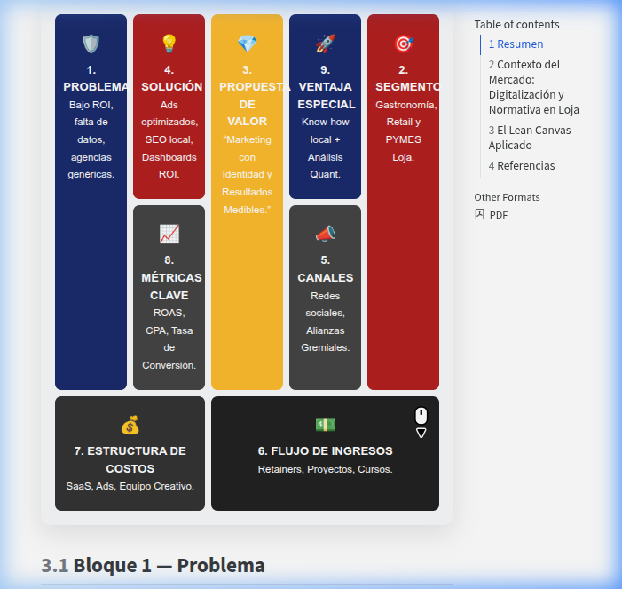
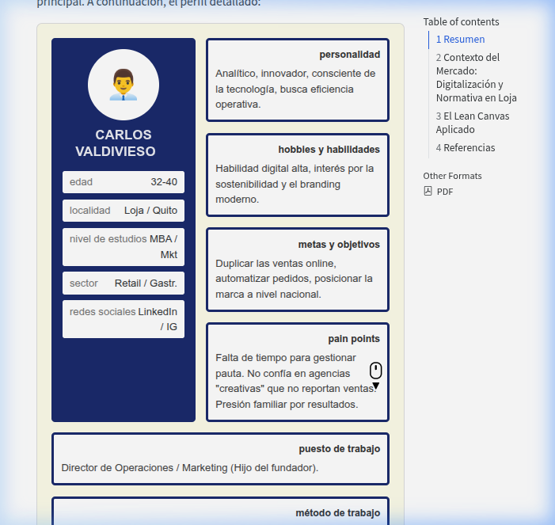

# Resumen

Este documento detalla la estrategia de validación de la **Agencia de Marketing Digital Loja (AMDL)**. En un mercado donde el **70% de las PYMES carecen de herramientas de analítica digital**, AMDL propone un modelo de *Performance Marketing* que trasciende la gestión creativa tradicional, integrando modelos econométricos para optimizar el **ROAS (Return on Ad Spend)** y la captura de valor en el tejido empresarial del sur del país.

# Contexto del Mercado: Digitalización y Normativa en Loja

El ecosistema empresarial de Loja está en un punto de inflexión. Según el REEM-INEC 2023, el cantón Loja cuenta con **38.679 establecimientos económicos activos** [@uasb2024loja]. De este total, los sectores con mayor potencial de digitalización inmediata son los **Restaurantes (2.190 locales)** y el **Retail de moda (1.108 locales)**, sumando una masa crítica de más de **3.200 prospectos directos** con alta rotación y necesidad de visibilidad digital.

| Actividad Económica (CIIU 4) | Establecimientos | % del Total |
|---|---|---|
| Comercio al por menor (alimentos) | 4.806 | 12% |
| Servicios personales | 2.296 | 6% |
| **Restaurantes y servicios de comida** | **2.190** | **6%** |
| Actividades profesionales/técnicas | 1.697 | 4% |
| **Retail (Prendas de vestir/calzado)** | **1.108** | **3%** |

: Estructura Empresarial de Loja (Segmentos Objetivo) {#tbl-loja-market}

A nivel institucional, Loja ha dado un salto cualitativo con la aprobación de la **Ordenanza No. 0068-2024 para la Transformación Digital** (Registro Oficial, abril 2025), la cual impulsa la digitalización de procesos y servicios [@municipioloja2025]. Este marco normativo, sumado a que Loja posee una de las tasas de uso de redes sociales más altas del país (**93,87% de penetración**), genera un entorno de alta demanda latente pero con una oferta de consultoría técnica aún inmadura [@mintel2024; @datapais2024].

# El Lean Canvas Aplicado

A continuación se detalla el lienzo de modelo de negocio adaptado para AMDL:

<style>
  .lean-canvas { 
    width: 100%; 
    table-layout: fixed; 
    border-collapse: separate; 
    border-spacing: 8px;
    text-align: center; 
    font-family: 'Inter', sans-serif; 
    margin-bottom: 2rem; 
    background-color: #f8f9fa;
    border-radius: 12px;
    padding: 10px;
    box-shadow: 0 10px 30px rgba(0,0,0,0.1);
  }
  .lean-canvas td { 
    border: none;
    padding: 20px 10px; 
    vertical-align: top; 
    border-radius: 8px;
    color: white;
    font-weight: bold;
    font-size: 0.85em;
  }
  .lc-prob { background-color: #1a2a6c; } /* Navy */
  .lc-sol { background-color: #b21f1f; } /* Red */
  .lc-uvp { background-color: #fdbb2d; color: #333; } /* Gold */
  .lc-ven { background-color: #1a2a6c; } /* Navy */
  .lc-seg { background-color: #b21f1f; } /* Red */
  .lc-met { background-color: #444; } /* Gray */
  .lc-can { background-color: #444; } /* Gray */
  .lc-cos { background-color: #333; } /* Dark Gray */
  .lc-ing { background-color: #222; } /* Blackish */
  .lc-icon { font-size: 1.5em; display: block; margin-bottom: 5px; }
</style>

<table class="lean-canvas">
  <tr style="height: 140px;">
    <td rowspan="2" class="lc-prob"><span class="lc-icon">🛡️</span>1. PROBLEMA<br><small style="font-weight: normal;">Bajo ROI, falta de datos, agencias genéricas.</small></td>
    <td class="lc-sol"><span class="lc-icon">💡</span>4. SOLUCIÓN<br><small style="font-weight: normal;">Ads optimizados, SEO local, Dashboards ROI.</small></td>
    <td rowspan="2" class="lc-uvp"><span class="lc-icon">💎</span>3. PROPUESTA DE VALOR<br><small style="font-weight: normal;">"Marketing con Identidad y Resultados Medibles."</small></td>
    <td class="lc-ven"><span class="lc-icon">🚀</span>9. VENTAJA ESPECIAL<br><small style="font-weight: normal;">Know-how local + Análisis Quant.</small></td>
    <td rowspan="2" class="lc-seg"><span class="lc-icon">🎯</span>2. SEGMENTO<br><small style="font-weight: normal;">Gastronomía, Retail y PYMES Loja.</small></td>
  </tr>
  <tr style="height: 140px;">
    <td class="lc-met"><span class="lc-icon">📈</span>8. MÉTRICAS CLAVE<br><small style="font-weight: normal;">ROAS, CPA, Tasa de Conversión.</small></td>
    <td class="lc-can"><span class="lc-icon">📣</span>5. CANALES<br><small style="font-weight: normal;">Redes sociales, Alianzas Gremiales.</small></td>
  </tr>
  <tr style="height: 80px;">
    <td colspan="2" class="lc-cos"><span class="lc-icon">💰</span>7. ESTRUCTURA DE COSTOS<br><small style="font-weight: normal;">SaaS, Ads, Equipo Creativo.</small></td>
    <td colspan="3" class="lc-ing"><span class="lc-icon">💵</span>6. FLUJO DE INGRESOS<br><small style="font-weight: normal;">Retainers, Proyectos, Cursos.</small></td>
  </tr>
</table>

::: {.content-visible when-format="pdf"}
{width=100%}
:::

## Bloque 1 — Problema {#b1}

1. **Brecha Analítica Crítica**: El **70% de las PYMES locales no utiliza analítica digital**, operando con presupuestos publicitarios basados en intuición, lo que genera un desperdicio estimado del 30-50% de la inversión en pauta [@copromerco2024].
2. **Invisibilidad en el Local Pack**: El **46% de las búsquedas en Google tienen intención local**, pero la mayoría de negocios en Loja tienen perfiles de Google Business Profile incompletos, perdiendo tráfico drive-to-store masivo [@seo593].
3. **Métricas de Vanidad y Vacío Competitivo**: Las agencias locales (The Blue Manakin, Símbolo) se enfocan en diseño y gestión de redes (Community Management), pero carecen de reporting basado en **ROAS y CPA**. No existe en Loja una agencia de "Performance Marketing" con rigor econométrico [@altitude2026; @bluemanakin].

| Agencia | Enfoque Principal | Debilidad Identificada |
|---|---|---|
| The Blue Manakin | Producción creativa/video | Sin reporting de ROI/ROAS |
| Símbolo | SEO/SEM Genérico | Sin segmentación quant local |
| Monkey Plus (Cuenca) | Estrategia 360 | Ticket alto, inaccesible a PYME |

: Análisis de Brecha Competitiva (Loja/Cuenca) {#tbl-competitors}

## Bloque 2 — Segmentos de Clientes {#b2}

*   **Segmento Gastronómico (Tier 1)**: Los **2.190 restaurantes de Loja** que enfrentan una competencia feroz y requieren sistemas de reserva y pedidos optimizados con un **CPC Search estimado en USD 0.15–0.50** [@uasb2024loja].
*   **Retail de Moda y Calzado (Tier 2)**: Los **1.108 establecimientos de retail** que compiten con cadenas nacionales (Tuti, Akí) y necesitan un **ROAS objetivo de 4.0x–5.0x** para ser sostenibles [@altitude2026].
*   **Early Adopters**: Empresas del sector "Segunda Generación Familiar" que, impulsadas por la **Ordenanza de Transformación Digital**, buscan profesionalizar el marketing del legado familiar.

### Matriz de Buyer Persona: "Carlos, Segunda Generación"

Aplicando la metodología estructurada, mapeamos a nuestro prospecto principal. A continuación, el perfil detallado:

::: {.content-visible when-format="html"}
```{=html}
<div class="buyer-persona-container" style="background-color: #FDFCE9; padding: 20px; font-family: sans-serif; border: 1px solid #ddd; border-radius: 8px; margin-bottom: 2em;">
  <div style="display: flex; gap: 15px; flex-wrap: wrap;">
    <!-- Columna Izquierda: Perfil -->
    <div style="background-color: #1a2a6c; width: calc(25% - 15px); min-width: 200px; border-radius: 5px; padding: 15px; display: flex; flex-direction: column; align-items: center; flex-grow: 1;">
      <div style="background-color: white; border-radius: 50%; width: 100px; height: 100px; display: flex; align-items: center; justify-content: center; font-size: 40px; margin-bottom: 10px;">
        👨‍💼
      </div>
      <h3 style="color: white; text-transform: uppercase; margin: 0 0 15px 0; text-align: center; font-size: 1.1em;">Carlos Valdivieso</h3>
      <div style="width: 100%; background-color: white; margin-bottom: 8px; padding: 5px 10px; border-radius: 3px; font-size: 0.85em; text-align: right; box-sizing: border-box;">
        <span style="float: left; color: #777;">edad</span> 32-40
      </div>
      <div style="width: 100%; background-color: white; margin-bottom: 8px; padding: 5px 10px; border-radius: 3px; font-size: 0.85em; text-align: right; box-sizing: border-box;">
        <span style="float: left; color: #777;">localidad</span> Loja / Quito
      </div>
      <div style="width: 100%; background-color: white; margin-bottom: 8px; padding: 5px 10px; border-radius: 3px; font-size: 0.85em; text-align: right; box-sizing: border-box;">
        <span style="float: left; color: #777;">nivel de estudios</span> MBA / Mkt
      </div>
      <div style="width: 100%; background-color: white; margin-bottom: 8px; padding: 5px 10px; border-radius: 3px; font-size: 0.85em; text-align: right; box-sizing: border-box;">
        <span style="float: left; color: #777;">sector</span> Retail / Gastr.
      </div>
      <div style="width: 100%; background-color: white; margin-bottom: 8px; padding: 5px 10px; border-radius: 3px; font-size: 0.85em; text-align: right; box-sizing: border-box;">
        <span style="float: left; color: #777;">redes sociales</span> LinkedIn / IG
      </div>
    </div>

    <!-- Columna Central -->
    <div style="display: flex; flex-direction: column; width: calc(37.5% - 15px); min-width: 250px; gap: 15px; flex-grow: 1;">
      <div style="border: 4px solid #1a2a6c; background-color: white; border-radius: 5px; padding: 10px; flex: 1;">
        <div style="text-align: right; font-weight: bold; font-size: 0.8em; color: #333; margin-bottom: 5px;">personalidad</div>
        <div style="font-size: 0.85em; color: #444;">Analítico, innovador, consciente de la tecnología, busca eficiencia operativa.</div>
      </div>
      <div style="border: 4px solid #1a2a6c; background-color: white; border-radius: 5px; padding: 10px; flex: 1;">
        <div style="text-align: right; font-weight: bold; font-size: 0.8em; color: #333; margin-bottom: 5px;">hobbies y habilidades</div>
        <div style="font-size: 0.85em; color: #444;">Habilidad digital alta, interés por la sostenibilidad y el branding moderno.</div>
      </div>
      <div style="border: 4px solid #1a2a6c; background-color: white; border-radius: 5px; padding: 10px; flex: 1;">
        <div style="text-align: right; font-weight: bold; font-size: 0.8em; color: #333; margin-bottom: 5px;">metas y objetivos</div>
        <div style="font-size: 0.85em; color: #444;">Duplicar las ventas online, automatizar pedidos, posicionar la marca a nivel nacional.</div>
      </div>
      <div style="border: 4px solid #1a2a6c; background-color: white; border-radius: 5px; padding: 10px; flex: 1;">
        <div style="text-align: right; font-weight: bold; font-size: 0.8em; color: #333; margin-bottom: 5px;">pain points</div>
        <div style="font-size: 0.85em; color: #444;">Falta de tiempo para gestionar pauta. No confía en agencias "creativas" que no reportan ventas. Presión familiar por resultados.</div>
      </div>
    </div>

    <!-- Columna Derecha -->
    <div style="display: flex; flex-direction: column; width: calc(37.5% - 15px); min-width: 250px; gap: 15px; flex-grow: 1;">
      <div style="border: 4px solid #1a2a6c; background-color: white; border-radius: 5px; padding: 10px; flex: 1;">
        <div style="text-align: right; font-weight: bold; font-size: 0.8em; color: #333; margin-bottom: 5px;">puesto de trabajo</div>
        <div style="font-size: 0.85em; color: #444;">Director de Operaciones / Marketing (Hijo del fundador).</div>
      </div>
      <div style="border: 4px solid #1a2a6c; background-color: white; border-radius: 5px; padding: 10px; flex: 1;">
        <div style="text-align: right; font-weight: bold; font-size: 0.8em; color: #333; margin-bottom: 5px;">método de trabajo</div>
        <div style="font-size: 0.85em; color: #444;">Uso de métricas (KPIs), reuniones semanales, enfoque en ROI.</div>
      </div>
      <div style="border: 4px solid #1a2a6c; background-color: white; border-radius: 5px; padding: 10px; flex: 2;">
        <div style="text-align: right; font-weight: bold; font-size: 0.8em; color: #333; margin-bottom: 5px;">herramientas que usa</div>
        <div style="font-size: 0.85em; color: #444;">Shopify, Meta Business Suite básico, Excel avanzado, ChatGPT para copys.</div>
      </div>
    </div>
  </div>

  <!-- Sección Inferior -->
  <div style="margin-top: 15px; border-left: 5px solid #b21f1f; border-top: 1px solid #ccc; border-right: 1px solid #ccc; border-bottom: 1px solid #ccc; padding: 15px; background-color: white;">
    <div style="font-size: 0.85em; font-weight: bold; color: #333; text-align: right; margin-bottom: 5px; text-transform: uppercase;">¿qué le podemos aportar nosotros como agencia?</div>
    <div style="font-size: 0.9em; color: #444; text-align: right;">Estrategia de Performance basada en datos (ROAS) y Dashboards en tiempo real.<br><strong>Libertad operativa para que se enfoque en escalar el negocio.</strong></div>
  </div>
</div>
```
:::

::: {.content-visible when-format="pdf"}
{width=100%}
:::

### Perfil del Buyer Persona: "Don Ricardo, Restaurantero Tradicional"

*   **Perfil**: Dueño de restaurante en el centro de Loja (45-55 años). 
*   **Punto de Dolor**: Siente que "gasta" en publicidad (Facebook/Instagram) pero no sabe si eso atrae clientes o es solo "suerte".
*   **Motivación**: Competir con las nuevas franquicias nacionales que están llegando a la ciudad.
*   **Barrera**: Desconfianza hacia las agencias que prometen "likes" y no ventas.
*   **Oportunidad AMDL**: Ofrecerle un dashboard donde vea: "Invertiste $200 y vendiste $1,000".

## Bloque 3 — Propuesta de Valor Única {#b3}

**"Marketing de resultados con rigor econométrico."** AMDL no solo gestiona redes, sino que implementa modelos de atribución y análisis de *uplift* para conectar cada dólar invertido con la variación real en las ventas.

*   **Diferenciador Técnico**: Uso de **Google Tag Manager y Meta Pixel Avanzado** para tracking de conversiones reales (reservas, llamadas, compras), garantizando un **ROAS mínimo aceptable de 3.0x** bajo contrato.
*   **Valor Local**: Estrategias de **Local SEO** para dominar el buscador en Loja, aprovechando el **93.87% de penetración de redes sociales** en la provincia.

## Bloque 4 — Solución {#b4}

1.  **Gestión de Pauta (Paid Media)**: Campañas enfocadas en ventas con optimización continua de ROAS.
2.  **SEO Local**: Posicionamiento en Google Maps para que los negocios sean encontrados por turistas y locales.
3.  **Contenido Estratégico**: Producción audiovisual de alta calidad que resalte la identidad de la marca.

## Bloque 5 — Canales {#b5}

*   **Propios**: Instagram, TikTok y LinkedIn (enfocado en dueños de negocio).
*   **Aliados**: Cámaras de la producción y gremios de jóvenes empresarios.
*   **Directos**: Networking en eventos locales y "Puerta Fría" digital con auditorías gratuitas.

| Formato Meta Ads | CTR Promedio (LATAM) | Aplicación en Loja |
|---|---|---|
| Reels Ads | 1.8% – 3.2% | Awareness de platos/menú |
| Collection Ads | 1.5% – 2.8% | Catálogo de Retail |
| Instant Experience | 2.4% – 4.1% | Landing de reservas |
| Carousel | 1.2% – 2.1% | E-commerce local |

: Benchmarks de Formatos Publicitarios (Andromeda Algorithm 2026) {#tbl-meta-formats}

## Bloque 6 — Flujo de Ingresos {#b6}

*   **Retainer de Performance (SME)**: **USD 400–600/mes** por gestión de pauta y optimización de conversiones.
*   **Fee por Resultados**: 10–15% sobre el crecimiento del ROAS incremental (el verdadero diferenciador).
*   **Auditoría y Setup de Tracking**: Pago único de **USD 150** para configuración de analítica avanzada.

| Nivel de Servicio | Fee Gestión | Pauta Sugerida | Entregables |
|---|---|---|---|
| **Básico (Semilla)** | $300 - $450 | $200 - $400 | Ads + Reporte Mensual |
| **Intermedio (Escala)** | $500 - $850 | $500 - $1,200 | Ads + SEO + Dashboards |
| **Premium (Elite)** | $1,000+ | $1,500+ | 360° + Analítica Predictiva |

: Matriz de Paquetes y Pricing AMDL {#tbl-pricing}

## Bloque 7 — Estructura de Costos {#b7}

*   **Herramientas**: Canva Pro, Meta Business Suite, Herramientas de SEO (Ahrefs/Semrush Lite).
*   **Ad Spend**: Presupuesto de prueba para campañas propias.
*   **Operación**: Freelancers creativos (fotografía/diseño) bajo demanda.

## Bloque 8 — Métricas Clave {#b8}

*   **ROAS (Return on Ad Spend)**: Meta mínima de 3.0x.
*   **CPA (Costo por Adquisición)**: Optimización mensual del costo por cliente nuevo.
*   **Retention Rate**: Mantener a los clientes por más de 6 meses.

## Bloque 9 — Ventaja Injusta {#b9}

1. **Rigor Econométrico**: Capacidad de vincular el gasto publicitario con la variación real de ingresos mediante modelos de atribución multi-touch y análisis de *uplift* publicitario.
2. **Eficiencia en Pauta Local**: Aprovechamiento de la baja competencia en Loja, logrando CPCs Search de **USD 0.15–0.50** (un 15-25% más bajo que el promedio nacional de USD 0.43) [@altitude2026].
3. **Reporting Automatizado**: Implementación de dashboards en **Google Looker Studio** que transforman datos crudos en decisiones de negocio accionables, eliminando la opacidad de las agencias tradicionales.

### Flujo de Atribución Econométrica AMDL

```{mermaid}
graph LR
    A[Inversión en Pauta] --> B{Algoritmo Meta/Google}
    B --> C[Clics/Interacciones]
    C --> D[Conversión en Local/Web]
    D --> E[Data Raw]
    E --> F[Modelo de Atribución AMDL]
    F --> G[Cálculo de ROAS Real]
    G --> H[Optimización de Gasto]
    style F fill:#f96,stroke:#333,stroke-width:4px
```

| Métrica | Benchmark Ecuador | Meta Saludable AMDL |
|---|---|---|
| ROAS Promedio | 3.5x - 4.2x | > 4.0x |
| CTR (Meta Ads) | 1.5% - 2.8% | > 2.5% |
| CPM (Meta) | USD 2.00 - 5.00 | < USD 4.00 |

: Benchmarks de Performance Operativa 2026 {#tbl-benchmarks}

# Referencias

::: {#refs}
:::
