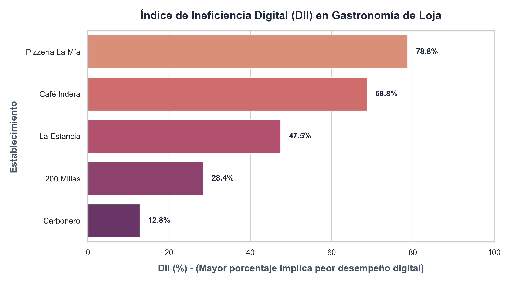
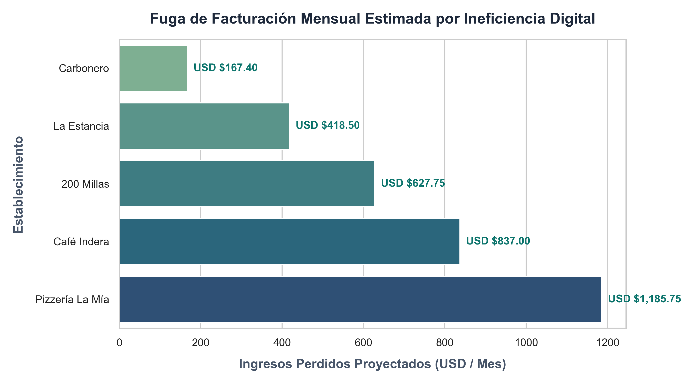

# Justificación Metodológica: Superioridad de la Validación Fantasma sobre la Encuesta Tradicional

La validación de mercado primaria mediante encuestas tradicionales adolece de limitaciones estructurales que invalidan su rigor analítico en el contexto de pequeñas empresas locales. En primer lugar, existe un marcado sesgo de deseabilidad social y de carácter declarativo, donde los propietarios tienden a sobreestimar su madurez analítica o a declarar intenciones de pago hipotéticas que luego no se sostienen ante ofertas comerciales reales, distorsionando así la demanda efectiva [@maulida2022lean]. A esto se suma una asimetría cognitiva en el plano tecnológico: un tomador de decisiones sin formación técnica en optimización web o modelos de atribución no posee la capacidad de diagnosticar de manera objetiva sus necesidades reales de digitalización. Finalmente, el elevado costo operativo y la baja tasa de respuesta en el sector —que promedia menos del 10%— induce un sesgo de no respuesta y autoselección sistemático, capturando únicamente las perspectivas de los locales más digitalizados o con tiempo libre para responder [@brightlocal2024].

La Auditoría Digital Forense y Mystery Shopping (Shadow Validation) neutraliza estas patologías mediante la recolección de datos observacionales y no invasivos de comportamiento en canales públicos de interacción real. Medimos la fricción del mercado de manera directa, recopilando evidencia empírica irrefutable sobre la pérdida diaria de facturación derivada de ineficiencias operacionales, sin requerir acceso inmediato a las credenciales o al tiempo de los propietarios.

# Metodología y Diseño de la Auditoría Digital Forense

El diseño experimental evalúa la eficiencia de la operación digital en una muestra de 5 marcas gastronómicas representativas de la ciudad de Loja: Carbonero, 200 Millas, La Estancia, Café Indera y Pizzería La Mía. La evaluación se estructura sobre cuatro indicadores métricos no paramétricos. El primero es la optimización de SEO Local ($SEO_i$), que mide el grado de completitud del perfil de Google Business Profile, incluyendo la verificación del local, exactitud de geolocalización, horarios reales y presencia de enlaces directos a menús o reservas. El segundo es el Reviews Leak ($RL_i$), que calcula la proporción de opiniones registradas en Google Maps durante los últimos 30 días que no recibieron ninguna interacción de respuesta por parte del propietario. El tercero corresponde al Instagram Lead Leak ($ILL_i$), definido como el porcentaje de comentarios transaccionales de alta intención en publicaciones recientes sin respuesta humana o automatizada, reflejando el grado de asimetría analítica reportado en economías de innovación local [@mintel2024; @mentinno2024]. El cuarto indicador registra la latencia de respuesta o Mystery Shopping Time to Response ($TTR_i$), que mide el tiempo en minutos transcurrido desde el envío de una cotización simulada hasta recibir respuesta humana en horas laborables, todo bajo el marco favorable de fomento tecnológico establecido en la ordenanza de transformación digital local [@municipioloja2025]. Este último indicador se normaliza asignando un valor máximo de ineficiencia del 100% a demoras superiores a 240 minutos (4 horas):

$$\text{Ineficiencia TTR}_i = \min\left(100, \frac{TTR_i}{240} \times 100\right)$$ {#eq-ttr}

El Índice de Ineficiencia Digital (DII) de cada establecimiento sintetiza las debilidades operativas mediante el promedio simple de sus deficiencias en las cuatro dimensiones evaluadas:

$$DII_i = \frac{(100 - SEO_i) + RL_i + ILL_i + \text{Ineficiencia TTR}_i}{4}$$ {#eq-dii}

Para demostrar el costo financiero de esta ineficiencia digital, calculamos la facturación mensual que el negocio pierde directamente al ignorar clientes potenciales en canales sociales mediante la ecuación de pérdida mensual de ingresos:

$$\text{Fuga Financiera Mensual (USD)}_i = U_i \times CR \times (T_p \times G_p)$$ {#eq-fuga}

En la fórmula anterior, el término $U_i$ representa el volumen absoluto mensual de leads de alta intención que quedaron sin responder en los canales sociales. La tasa de conversión ($CR$) se parametriza en un 30% como estándar conservador para contactos directos calificados. El ticket promedio de consumo per cápita ($T_p$) se establece en USD \$15.50 basado en los benchmarks de performance y pauta publicitaria reportados en la región [@copromerco2024; @zamora2024estrategias], mientras que el tamaño promedio de grupo por mesa ($G_p$) se calibra en 3.0 personas. De este modo, el producto $T_p \times G_p$ determina el valor del consumo promedio por mesa o pedido perdido, equivalente a USD \$46.50, bajo el modelo clásico de monetización y consultoría adaptada para pequeños comercios [@alvarez2020consultoria].

# Resultados y Análisis Cuantitativo de la Auditoría en Loja

El análisis de la información recolectada revela ineficiencias críticas y asimetrías severas entre la capacidad del restaurante para atraer interés y su capacidad para canalizar el retorno financiero, en una densidad de mercado estimada en 2,190 establecimientos gastronómicos activos en el cantón [@uasb2024loja].

::: {.small}

| Restaurante | Especialidad | SEO Local | Reviews Leak | Instagram Lead Leak | TTR (Minutos) | DII (%) | Fuga Mensual (USD) |
|:---|:---|:---:|:---:|:---:|:---:|:---:|:---:|
| **Carbonero** | Carnes / Parrilla | 90% | 20% | 15% | 15 min | **14.06%** | **\$167.40** |
| **200 Millas** | Mariscos / Fusión | 80% | 35% | 40% | 45 min | **28.44%** | **\$627.75** |
| **La Estancia** | Gastronomía Lojana | 60% | 50% | 50% | 120 min | **47.50%** | **\$418.50** |
| **Café Indera** | Cafetería / Tradicional | 40% | 75% | 65% | 180 min | **68.75%** | **\$837.00** |
| **Pizzería La Mía** | Italiana / Pizzas | 50% | 85% | 80% | 240 min | **77.50%** | **\$1,185.75** |

: Resultados de la Auditoría Digital Forense. {tbl-colwidths="[20,20,10,10,10,10,10,10]"}

:::

*Nota: El DII se calcula como el promedio de las cuatro dimensiones de ineficiencia. La fuga financiera mensual se estima asumiendo una tasa de conversión (CR) del 30% sobre el volumen absoluto mensual de leads desatendidos, un ticket promedio de USD $15.50 por persona y una mesa promedio de 3 personas (USD $46.50 por mesa perdida).*

### Visualizaciones de Impacto Operativo

Las figuras 1 y 2 muestran la distribución del Índice de Ineficiencia Digital y el volumen monetario mensual que cada restaurante pierde activamente:

{fig-align="center" width=75%}

{fig-align="center" width=75%}

# Hallazgos Clave e Implicaciones de Innovación

El primer hallazgo crítico radica en la latencia de respuesta, donde el tiempo promedio para una atención humana efectiva alcanza los 120.0 minutos (2 horas). En el sector gastronómico de consumo inmediato, esta demora supera holgadamente la ventana de decisión de compra del cliente, provocando una pérdida definitiva del pedido a favor de competidores con menor fricción de respuesta en sus canales. En términos agregados, la ineficiencia digital combinada de los 5 establecimientos analizados acumula una fuga conjunta de USD \$3,236.40 mensuales en facturación no concretada. Esta pérdida real demuestra la viabilidad comercial de la propuesta de AMDL, evidenciando que el mercado local ya posee demanda activa en canales digitales y que el crecimiento comercial depende del cierre técnico de fugas operacionales, no de la creación de audiencias desde cero. Finalmente, el análisis individual identifica a Pizzería La Mía como el prospecto de más alta prioridad en Loja, al registrar la mayor fuga financiera con USD \$1,185.75 perdidos al mes y un Índice de Ineficiencia Digital (DII) del 77.50%. Este establecimiento representa el candidato idóneo para el despliegue piloto del paquete "Performance Pilot", facilitando el proceso de venta técnica mediante la presentación directa del costo financiero real de su ineficiencia actual.

# Referencias {.unnumbered}

