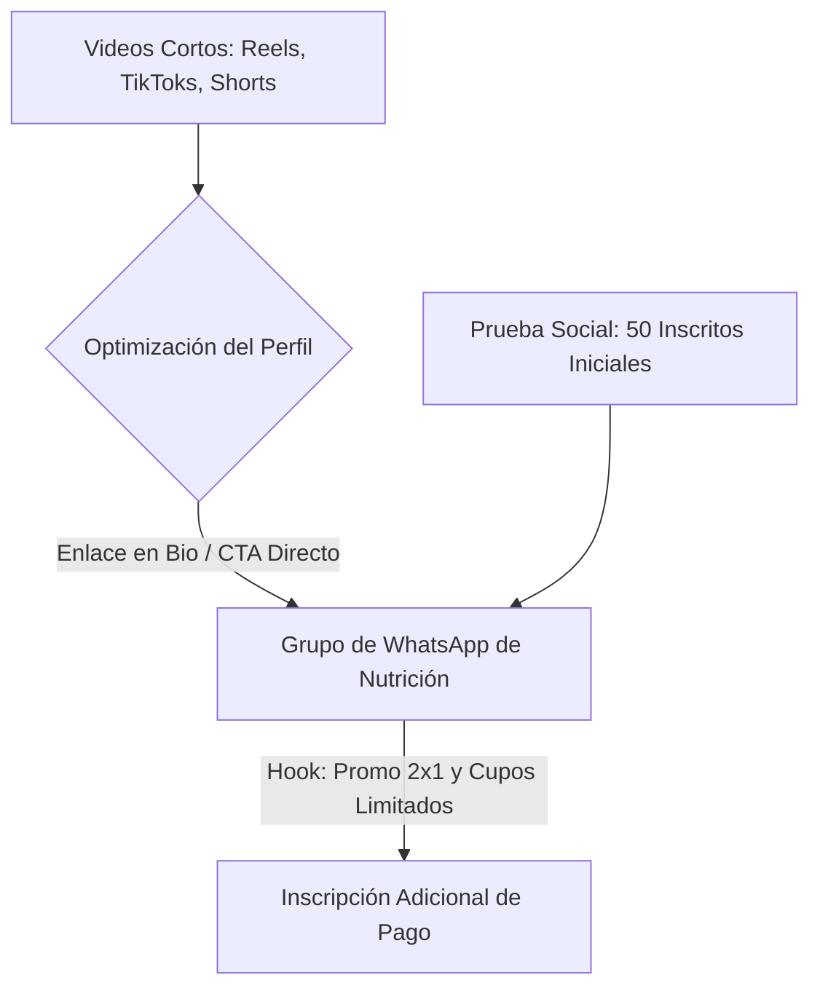

# Introducción y Objetivos de Validación

Un dato crucial de partida es que la consultora **ya cuenta con 50 personas inscritas** de manera orgánica antes de nuestra intervención, a pesar de contar con canales sociales prácticamente inactivos y sin seguidores (e.g., la página de Facebook: `https://www.facebook.com/profile.php?id=61590320282371`). Esto demuestra la existencia de una sólida demanda y la alta autoridad del ponente. La meta de AMDL no es generar demanda desde cero mediante pauta pagada, sino **validar la agencia optimizando la conversión y el alcance orgánico** a través del rediseño del perfil digital, la ingeniería de contenidos y la explotación de la prueba social existente en una ventana crítica de **5 días** (hasta el inicio del curso el 08 de junio de 2026).

# Estrategia de Validación de la Agencia (Organic Proof of Concept)

Validaremos el valor de la agencia demostrando nuestra capacidad de estructurar y ejecutar una estrategia de contenido orgánico de alta conversión que genere inscritos adicionales.

## Hipótesis a Validar
1. **Hipótesis de Optimización ($H_1$):** El embellecimiento estético y la claridad del embudo en las redes sociales de la consultora incrementarán la tasa de conversión de visitantes a miembros del canal de WhatsApp.
2. **Hipótesis de Tracción Orgánica ($H_2$):** La distribución sistemática de contenido fragmentado (micro-learning) del docente generará suficiente alcance orgánico local para atraer nuevos prospectos sin inversión en pauta.

## Estructura del Trato de Validación
* **Inversión Publicitaria:** USD \$0 (Estrategia 100% orgánica).
* **Compensación por Resultados:** Comisión del 25% sobre la matrícula de cada alumno adicional que ingrese al grupo de WhatsApp y pague el curso durante la ventana de nuestra campaña.
* **Métrica de Éxito:** Atraer al menos 10 nuevos inscritos de pago (incremento del 20% sobre la base de 50 alumnos iniciales) utilizando exclusivamente tráfico orgánico.

# Diseño del Embudo Orgánico Express (WhatsApp-First)

El embudo aprovecha el tráfico de las redes optimizadas de la consultora (Facebook, Instagram, TikTok) y lo dirige hacia el grupo de WhatsApp de nutrición y cierre (`https://chat.whatsapp.com/LYQF7mTP0K27jK3wj81SOF`).

## Tácticas de Crecimiento Orgánico y Optimización

1. **Optimización Estética y de Conversión (Profile Hacking):**
   * **Facebook & Instagram:** Rediseñar la foto de perfil y de portada de la consultora utilizando una paleta corporativa y tipografía moderna. Colocar en la biografía un llamado a la acción (CTA) directo: *"Últimos cupos 2x1 para el Curso Práctico de Proyectos de Cooperación Internacional. Únete aquí 👇"* con el link directo a WhatsApp.
2. **Content Repurposing de Autoridad (Micro-Contenidos):**
   * Extraer fragmentos de 30-40 segundos de las clases y conferencias del canal de YouTube del Econ. José Vicente Ordóñez Yaguache.
   * Editar los clips en formato vertical (9:16) usando CapCut, agregando subtítulos dinámicos y un CTA al final: *"Comenta COOPERACION y te enviamos el link de acceso al grupo 2x1."*
3. **El Motor de Prueba Social (Efecto Bandwagon):**
   * Publicar historias y posts destacando el hito de los **50 primeros inscritos**: *"¡50 profesionales y estudiantes listos para transformar sus proyectos! Quedan pocos cupos con el beneficio 2x1."* Esto genera urgencia real y valida la calidad del curso.

# Métricas de Desempeño y Cronograma (5 Días)

El rendimiento de la estrategia orgánica se medirá con métricas de conversión y tracción de embudo social:

## Indicadores Clave de Rendimiento (KPIs)
* **CTR de Enlace en Bio ($CTR_{bio}$):** `(Clics en enlace de WhatsApp / Visitas al Perfil) * 100`. Meta: $\ge 8\%$.
* **Crecimiento Orgánico del Grupo ($\Delta WA$):** Número de nuevos miembros en el grupo de WhatsApp durante la campaña. Meta: $\ge 30$ miembros.
* **Tasa de Cierre Orgánico ($CR_{org}$):** `(Nuevos Inscritos de Pago / Nuevos Miembros WA) * 100`. Meta: $\ge 25\%$.

## Cronograma de Ejecución Orgánica

| Día | Fase | Actividad Clave | Entregable |
|:---|:---|:---|:---|
| **Día 1** | Optimización | Rediseño de portadas, bios y enlaces en Facebook, Instagram y TikTok de Planning Solutions. | Perfiles optimizados para conversión. |
| **Día 2** | Lanzamiento | Publicación de los primeros 2 reels/TikToks con el hook del docente y la prueba social (50 inscritos). | 2 videos cortos publicados. |
| **Día 3** | Interacción | Publicación de testimonios o temarios y respuesta rápida a comentarios con la palabra clave. | Primeros clics y accesos a WhatsApp. |
| **Día 4** | Urgencia | Historias enfocadas en la escasez: *"Últimas 24 horas para acceder al 2x1. El curso inicia mañana."* | Picos de entrada a WhatsApp. |
| **Día 5** | Cierre | Cierre manual de inscripciones dentro del grupo de WhatsApp y reporte de matrículas. | 10+ nuevos alumnos inscritos. |

Esta estrategia permite validar el enfoque analítico y creativo de la agencia, demostrando que la optimización de los canales existentes y el uso correcto de la prueba social pueden generar retornos significativos sin necesidad de presupuesto publicitario, al tiempo que reduce el riesgo del cliente y capitaliza la urgencia del calendario académico local.
