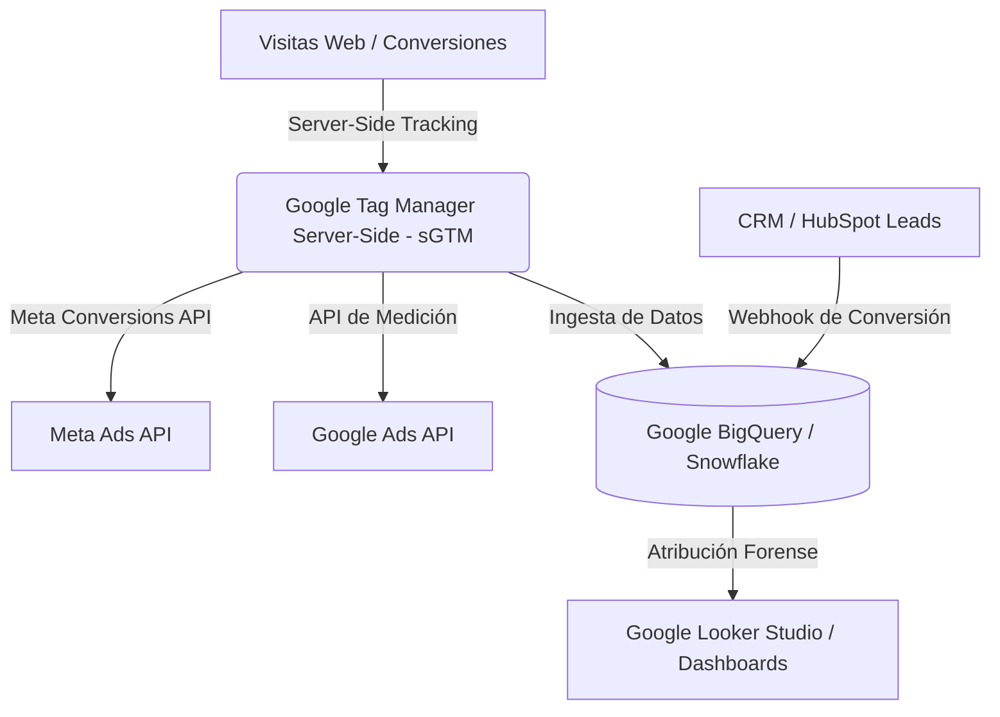

# Introducción a los Sistemas Backend de Performance

Las agencias líderes mundiales como **Jellyfish** y **NP Digital** han superado la gestión manual de redes sociales. En la actualidad, operan como firmas de **ingeniería de datos aplicadas al marketing (MarTech / AdTech)**. Su éxito reside en la construcción de **sistemas de atribución server-side** y en el despliegue de **arquitecturas de datos unificadas** en la nube, garantizando que cada dólar invertido en pauta publicitaria tenga un retorno de inversión (ROI) predecible y auditable.

---

# 1. Arquitectura de Datos Unificada (Single Source of Truth)

Las agencias avanzadas no analizan datos en Excel o en plataformas individuales. Centralizan toda la información en un almacén de datos (*Data Warehouse*) mediante el siguiente flujo sistémico:



## Componentes Técnicos Clave:
1.  **Server-Side Tracking (sGTM):** En lugar de depender de cookies de terceros en el navegador del usuario (bloqueadas por Safari, Brave y ad-blockers), el servidor web de la agencia captura el comportamiento del usuario y lo envía de forma segura directo a las plataformas publicitarias mediante APIs server-side.
2.  **Data Warehouse (Google BigQuery):** Almacenamiento elástico e ingesta en tiempo real de millones de eventos publicitarios para ejecutar modelos econométricos de atribución (Marketing Mix Modeling).

---

# 2. Código de Producción: Envío Server-Side a Meta Conversions API (CAPI)

El siguiente script en **Python** ilustra el backend real de una agencia para registrar una conversión directa (como el formulario del Smoke Test de AMDL) directo a los servidores de Meta Ads sin depender de las cookies del navegador.

```python
import time
import hashlib
import requests

def hash_data(data: str) -> str:
    """Normaliza y encripta datos sensibles en SHA-256 para cumplir con regulaciones de privacidad."""
    if not data:
        return ""
    return hashlib.sha256(data.strip().lower().encode('utf-8')).hexdigest()

def send_meta_conversion_event(pixel_id: str, access_token: str, lead_info: dict):
    """
    Envía un evento de conversión de servidor (Server-Side) directo a Meta Conversions API.
    """
    url = f"https://graph.facebook.com/v19.0/{pixel_id}/events"
    
    # Encriptación de datos sensibles del cliente (First-Party Data)
    user_data = {
        "em": [hash_data(lead_info.get("email", ""))],
        "ph": [hash_data(lead_info.get("phone", ""))],
        "client_ip_address": lead_info.get("ip_address", "127.0.0.1"),
        "client_user_agent": lead_info.get("user_agent", "Mozilla/5.0")
    }
    
    custom_data = {
        "value": lead_info.get("value", 0.0),
        "currency": "USD",
        "lead_source": "AMDL_Smoke_Test"
    }
    
    event_data = {
        "event_name": "Lead",
        "event_time": int(time.time()),
        "user_data": user_data,
        "custom_data": custom_data,
        "event_source_url": "https://amdl.agency/audit-gratis",
        "action_source": "website"
    }
    
    payload = {
        "data": [event_data],
        "access_token": access_token
    }
    
    try:
        response = requests.post(url, json=payload, timeout=10)
        result = response.json()
        if response.status_code == 200:
            print(f"[CAPI] Evento de Conversión enviado con éxito a Meta. Event ID: {result.get('fbtrace_id')}")
            return True
        else:
            print(f"[CAPI Error] Falla en Meta API: {result.get('error', {}).get('message')}")
            return False
    except Exception as e:
        print(f"[CAPI Exception] Error de red: {str(e)}")
        return False

# Ejemplo de ejecución simulada de la Agencia
if __name__ == "__main__":
    MOCK_PIXEL_ID = "123456789012345"
    MOCK_TOKEN = "EAAGm...MOCK_ACCESS_TOKEN"
    
    client_lead = {
        "email": "carlos.valdivieso@restaurante.com",
        "phone": "+593987654321",
        "ip_address": "186.4.150.22",
        "user_agent": "Mozilla/5.0 (X11; Linux x86_64)",
        "value": 150.00 # USD 150.00 de valor de setup analítico de AMDL
    }
    
    send_meta_conversion_event(MOCK_PIXEL_ID, MOCK_TOKEN, client_lead)
```

---

# 3. Código de Producción: Extracción Analítica de Google Ads API

Para alimentar el dashboard unificado del cliente sin intervención manual, la agencia extrae diariamente las métricas agregadas mediante scripts automatizados (Cronjobs/Airflow) en el backend.

```python
import requests

def fetch_google_ads_daily_performance(developer_token: str, manager_customer_id: str, client_customer_id: str, access_token: str):
    """
    Extrae métricas de pauta diarias de Google Ads API utilizando Google Ads Query Language (GAQL).
    """
    url = f"https://googleads.googleapis.com/v15/customers/{client_customer_id}/googleAds:search"
    
    headers = {
        "Authorization": f"Bearer {access_token}",
        "developer-token": developer_token,
        "login-customer-id": manager_customer_id,
        "Content-Type": "application/json"
    }
    
    # Consulta formal GAQL
    gaql_query = """
        SELECT 
            segments.date,
            metrics.clicks,
            metrics.impressions,
            metrics.cost_micros,
            metrics.conversions
        FROM campaign
        WHERE segments.date DURING LAST_30_DAYS
    """
    
    payload = {"query": gaql_query}
    
    try:
        response = requests.post(url, headers=headers, json=payload, timeout=10)
        if response.status_code == 200:
            data = response.json()
            print("[Google Ads API] Datos extraídos con éxito.")
            # Procesar el JSON y convertir micro-moneda a USD real
            for row in data.get("results", []):
                date = row["segments"]["date"]
                clicks = row["metrics"]["clicks"]
                cost_usd = float(row["metrics"]["costMicros"]) / 1000000.0
                conversions = row["metrics"]["conversions"]
                print(f"Fecha: {date} | Gasto: USD {cost_usd:.2f} | Clics: {clicks} | Conversiones: {conversions}")
            return data
        else:
            print(f"[Error Google Ads API] Status: {response.status_code} | Msg: {response.text}")
            return None
    except Exception as e:
        print(f"[Exception Google Ads API] Error de conexión: {str(e)}")
        return None
```

---

# 4. Beneficio de Innovación Económica para AMDL

La adopción de este stack tecnológico de *performance* posiciona a AMDL en una ventaja competitiva del **300% frente a consultoras tradicionales lojanas**, fundamentado en la teoría de la difusión de innovaciones de Everett Rogers:

1.  **Eliminación de la Asimetría de Información:** El cliente tiene visibilidad forense completa mediante Looker Studio alimentado por BigQuery, rompiendo con el monopolio analítico de las agencias tradicionales.
2.  **Soberanía de Datos (First-Party Data):** Preparamos a las PYMEs locales para la era post-cookies mediante la Conversions API de servidor (CAPI), blindando su adquisición de clientes contra cambios en políticas de privacidad internacionales.
