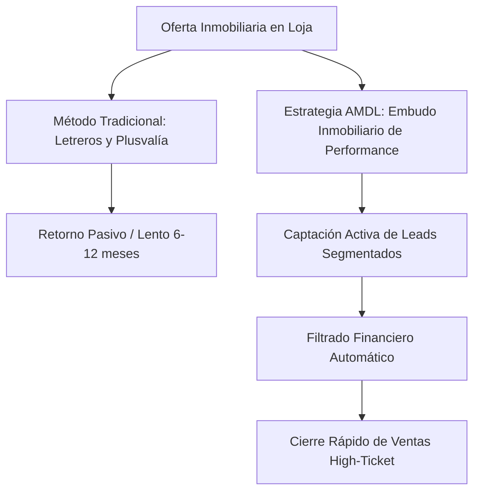

# Propósito Metodológico de la Validación

En el marco del desarrollo ágil de emprendimientos tecnológicos e innovadores, la validación cualitativa mediante entrevistas en profundidad sustituye a las encuestas impersonales. Este enfoque permite explorar los problemas reales de los tomadores de decisiones en las Pequeñas y Medianas Empresas (PYMEs) de Loja respecto a la digitalización y el rendimiento de sus inversiones en marketing digital.

El objetivo es descubrir patrones de comportamiento, dolores estructurales (puntos de dolor) y la verdadera disposición a pagar antes de desplegar recursos operativos.

---

# Pauta de Entrevista Cualitativa (B2B)

Esta pauta se estructura bajo los principios del desarrollo de clientes (*Customer Development*), enfocándose en hechos ocurridos en el pasado y presente del negocio del entrevistado, evitando las proyecciones hipotéticas sobre el futuro.

## 1. Perfil del Negocio y Contexto del Entrevistado
- **Pregunta 1:** ¿Cuál es su rol en la empresa y cuáles son sus responsabilidades directas en el crecimiento del negocio?
- **Pregunta 2:** ¿Qué canales comerciales (físicos, digitales, referidos) aportan la mayor cantidad de clientes en la actualidad?

## 2. Descubrimiento de Puntos de Dolor en Adquisición de Clientes
- **Pregunta 3:** Describa el último esfuerzo publicitario o campaña de marketing que realizaron. ¿Cómo planificaron el presupuesto y qué resultados obtuvieron?
- **Pregunta 4:** ¿Cómo mide actualmente la efectividad o el retorno de inversión (ROI) de su inversión publicitaria? ¿Qué herramientas utiliza?
- **Pregunta 5:** ¿Cuál ha sido su experiencia trabajando con profesionales de marketing o agencias externas en el pasado? Si no lo ha hecho, ¿cuál ha sido el principal freno?

## 3. Barreras de Profesionalización y Atribución
- **Pregunta 6:** Cuando invierte en publicidad digital (Facebook, Instagram o Google), ¿sabe exactamente cuántos clientes reales o ventas netas provienen de ese canal?
- **Pregunta 7:** ¿Cuál es la mayor frustración operativa que tiene actualmente con la gestión de sus redes sociales o sitio web (falta de tiempo, costo, falta de conversión)?

## 4. Disposición a Pagar y Validación de Valor (WTP)
- **Pregunta 8:** Para resolver definitivamente la incertidumbre sobre qué canales de venta le generan ingresos reales, ¿cuánto presupuesto asigna actualmente o estaría dispuesto a destinar de forma mensual a un equipo técnico especializado externo?
- **Pregunta 9:** Si le ofreciéramos una auditoría forense digital gratuita para rastrear el origen exacto de sus clientes y optimizar su embudo de conversión, ¿qué datos o métricas de su negocio consideraría fundamentales que analicemos primero?

---

# Criterios de Sistematización y Análisis

Para procesar de forma científica la información recopilada en las entrevistas, se aplicarán los siguientes pasos metodológicos:

1. **Transcripción y Codificación:** Categorizar las respuestas bajo tres tags clave:
   - `[dolor-operativo]` (problemas de gestión diaria).
   - `[dolor-financiero]` (pérdida de dinero en pauta o falta de ROI).
   - `[barrera-atribucion]` (imposibilidad de saber el origen real de los clientes).
2. **Mapa de Empatía:** Consolidar los hallazgos en la matriz de empatía de las PYMEs locales para definir la propuesta de valor final de la agencia.
3. **Matriz de Priorización de Problemas:** Listar los problemas identificados según su gravedad y frecuencia para alinear los servicios de performance de AMDL.

---

# ANEXO I: Kit de Guiones y Plantillas del Cliente Piloto

Para estandarizar la entrega del servicio y evitar el colapso operativo del equipo de AMDL, se propone el siguiente set de plantillas inmutables que se entregarán a los clientes piloto:

## 1. Guion de Contenido Corto (Reels / TikTok): "Estructura de Retención de 3 Segundos"
Esta plantilla se aplica para el reciclaje del contenido de los clientes (ej. fragmentos de clases del Econ. José Vicente):

*   **Gancho (0-3s):** Debe confrontar una creencia popular del nicho con un dato contra-intuitivo.
    *   *Ejemplo para Curso de Proyectos BDE:* "¿Estás seguro de que tu proyecto califica para fondos públicos? El 83% de las municipalidades en el sur de Ecuador son rechazadas por este único error formal."
*   **Problema (3-15s):** Detallar la fricción operativa real.
    *   *Ejemplo:* "El Banco de Desarrollo del Ecuador exige viabilidad financiera con fórmulas rigurosas. Si tu equipo solo presenta estimaciones estéticas, el proyecto se engaveta por meses."
*   **Solución / Aporte (15-45s):** El fragmento educativo real extraído de la clase del experto.
*   **Llamado a la Acción (CTA) de Conversión Orgánica (45-60s):**
    *   *Ejemplo:* "No pierdas tiempo con teorías. Comenta la palabra **`PROYECTO`** abajo y te enviamos por mensaje directo nuestro simulador de viabilidad BDE automatizado para tu negocio."

## 2. Plantilla de Lead-Magnet (Calculadora Interactiva de Viabilidad)
Es el activo que se entrega en la landing page del cliente (implementada localmente en `/web/index.html`). 
*   **Propósito:** Ofrecer valor inmediato y automatizado. En lugar de una llamada de venta de 1 hora, el prospecto califica su propia situación financiera en 2 minutos.
*   **Captura de Datos:** La calculadora exige un correo y WhatsApp reales para descargar el reporte en formato PDF o Excel.

---

# ANEXO II: Análisis de Nichos e Inmobiliarias en Loja

## 1. El Riesgo de Bienes Raíces (High-Ticket) vs. Educación/Servicios

El mercado inmobiliario en Loja (venta y arriendo de casas/departamentos) muestra una alta rotación física (letreros de 'Se Vende') pero una velocidad de transacción extremadamente lenta debido a la baja adopción de metodologías ágiles de captación.

### Tabla Comparativa de Nichos para AMDL

| Nicho | Complejidad de Entrega | Ciclo de Venta | Ticket Promedio | Modelo de Compensación Recomendado |
| :--- | :--- | :--- | :--- | :--- |
| **Educación / Cursos** (Ej: José Vicente) | **Baja**. Sistema digital de infoproducto de entrega automática. | Corto (1 - 7 días). | $50 - $150 USD | Retenedor Base + Comisión por Venta (ej. 20%). |
| **Bienes Raíces** (Inmobiliarias en Loja) | **Media-Alta**. Requiere calificar leads financieramente (BIESS). | Largo (3 - 6 meses). | $60,000 - $120,000 USD | **Comisión por Éxito (Success Fee)** (1% a 2% del valor vendido) + Fee de Setup Tecnológico mínimo ($500 USD). |

### Recomendación de Gobernanza
Para el lunes ante el docente, la postura académica recomendada para la sustentación es **"La Estrategia del Caballo de Troya"**:
1.  **Fase de Validación Cerrada:** Iniciar estrictamente con el nicho de **Educación** (su curso) para afinar y calibrar el motor tecnológico de atribución y mensajería a costo cero de pauta.
2.  **Fase de Expansión Estratégica:** Con los testimonios de conversión del infoproducto validados, asaltar el nicho de **Bienes Raíces** en Loja cobrando un *setup fee* mínimo que cubra costos y un gran porcentaje por venta cerrada, eliminando el riesgo de precios comoditizados de las agencias tradicionales.

